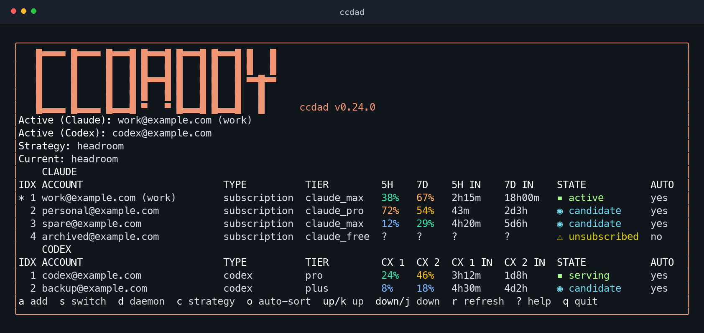

<p align="center">
  
  <br>
  <sub>The actual ccdad TUI, captured with example accounts and no real credentials.</sub>
</p>

# ccdaddy

**Quota-aware account management for Claude Code and Codex.**

`ccdad` stores your accounts, monitors usage, and rotates accounts as quota runs
low. Its terminal dashboard brings account status, usage windows, reset times,
switching policy, and capacity forecasts into one view.

[](https://github.com/Kweiza/ccdaddy/actions/workflows/ci.yml)
[](https://github.com/Kweiza/ccdaddy/releases)
[](LICENSE)

| | Claude Code | Codex |
|---|---|---|
| Add an account | `ccdad add claude` | `ccdad add codex` |
| How requests use it | ccdad updates the managed Claude login, including macOS Keychain storage | ccdad routes requests through a local authenticated proxy |
| Follow account changes | Sessions using the managed login can follow switches | Already-routed, unpinned conversations follow the serving account on their next request |
| Pin a session | `ccdad run c1` | `ccdad run x1` |
| Display indexes | `1, 2, 3, …` within Claude | `1, 2, 3, …` within Codex |

**Codex must run through the ccdad wrapper to use ccdad's accounts.** A provider
shown as `openai` in Codex's `/status` is a direct session; changing ccdad's serving
account does not move it. See [Codex accounts](#codex-accounts).

## Contents

- [Install](#install)
- [Quick start](#quick-start)
- [The dashboard](#the-dashboard)
- [Commands](#commands)
- [Account references and ordering](#account-references-and-ordering)
- [Codex accounts](#codex-accounts)
- [Switching strategies](#switching-strategies)
- [Configuration](#configuration)
- [Running sessions side by side](#running-sessions-side-by-side)
- [Running ccdad on more than one machine](#running-ccdad-on-more-than-one-machine)
- [Claude Code's own tools](#claude-codes-own-tools)
- [How the switch stays safe](#how-the-switch-stays-safe)
- [Containers](#containers)
- [Scripting](#scripting)
- [Troubleshooting](#troubleshooting)
- [Building from source](#building-from-source)

## Install

Install Claude Code or Codex separately. ccdad's release binaries are standalone;
they do not require Go or Node.js to run.

**macOS and Linux**

```sh
curl -fsSL https://raw.githubusercontent.com/Kweiza/ccdaddy/main/install.sh | bash
```

The default destination is `~/.local/bin`. If it is not on your PATH yet:

```sh
~/.local/bin/ccdad setup-path
```

Open a new terminal after changing shell startup files.

**Windows — PowerShell 5.1 or newer**

```powershell
irm https://raw.githubusercontent.com/Kweiza/ccdaddy/main/install.ps1 | iex
```

On older PowerShell 5.1 hosts, enable TLS 1.2 first if the download fails:

```powershell
[Net.ServicePointManager]::SecurityProtocol = [Net.SecurityProtocolType]::Tls12
```

The Windows installer adds `%LOCALAPPDATA%\Programs\ccdad` to the user PATH and
updates the current PowerShell session. Release targets are Linux, macOS and
Windows, each on amd64 and arm64.

### Installer options

| Environment variable | Meaning | Default |
|---|---|---|
| `CCDAD_INSTALL_DIR` | Installation directory | `~/.local/bin` on Unix; `%LOCALAPPDATA%\Programs\ccdad` on Windows |
| `CCDAD_VERSION` | A specific release tag | Latest stable release |
| `CCDAD_BASE_URL` | Release download origin for a mirror | GitHub releases |

Both installers verify SHA-256 checksums before replacing the binary. The Unix
installer does not edit shell startup files; `ccdad setup-path` manages those.
Windows binaries are not Authenticode-signed, so SmartScreen may show a warning.

### Upgrading

```sh
ccdad update --check            # check availability and installation writability
ccdad update                    # verify and install the latest stable release
ccdad update --version v0.24.0   # select a specific release, including a downgrade
```

`ccdad update` verifies signed checksums, checks the downloaded binary, and
restarts the daemon if one was running. It has no verification-bypass option.
Package-manager installations must be upgraded through their package manager.

The updater keeps the architecture of the running binary. Re-run the installer
to move from an amd64 build under emulation to a native arm64 build. Re-running
an installer stops the old daemon; normal account commands or
`ccdad daemon start` bring it back.

### Verifying the download

Releases include six binaries, `sha256sums.txt`, `sha256sums.txt.minisig`, license
notices, and GitHub build-provenance attestations. Using a trusted checkout's
[public key](ccdaddy.pub), verify downloaded checksums and their named release:

```sh
minisign -Vm sha256sums.txt -p ccdaddy.pub
sha256sum --ignore-missing -c sha256sums.txt
```

On macOS, use `shasum -a 256 --ignore-missing -c sha256sums.txt` for the second
command. Check that the signed trusted comment names the release you intended
to download. An attestation can be checked independently:

```sh
gh attestation verify ccdad-linux-amd64 --repo Kweiza/ccdaddy
```

### Removing it

```sh
ccdad uninstall
```

This stops the daemon and removes ccdad's store, registration, and binary. Use it
instead of deleting the binary alone.

## Quick start

### Claude Code

```sh
ccdad add claude --alias work --activate
ccdad add claude --alias personal
ccdad status
ccdad                       # interactive dashboard; requires a terminal
claude
```

Adding an account stores it without switching unless you pass `--activate`.
For a browser login from a headless terminal:

```sh
ccdad add claude --no-browser --timeout 15m
```

The pasted-code flow still requires a terminal on stdin. `ccdad add-token` accepts
API keys and setup tokens, but those are not refreshable browser logins and do
not provide the usage polling needed for automatic rotation.

### Codex

```sh
ccdad add codex              # device-code login
ccdad codex shim install     # Unix wrapper; add also attempts this automatically
# Open a new terminal, then verify the wrapper is first on PATH:
command -v codex
codex
```

On Unix, `command -v codex` should resolve to `~/.ccdad/bin/codex`. In Codex,
`/status` should show provider **`ccdad`**. To route explicitly, independently of
shell PATH order, use:

```sh
ccdad codex exec
```

On Windows, use this explicit launcher; ccdad does not install a Windows Codex
shim. See [Routing and resuming sessions](#routing-and-resuming-sessions).

## The dashboard

Run bare `ccdad` in a terminal. Use `ccdad status` for a text listing or
`ccdad status --json` for scripts.

The dashboard groups accounts by provider. Each group has its own quota columns:
Claude's 5-hour, 7-day and scoped windows; Codex's primary and secondary windows
with durations supplied by its API. `?` means unknown; `-` means that quantity is
not present. A failed reading is never displayed as zero usage.

| Key | Action |
|---|---|
| `up` / `k`, `down` / `j` | Move between accounts in displayed order |
| `s` | Switch to the account under the cursor |
| `a` | Choose a provider and add an account |
| `o` | Toggle automatic sorting by the nearest 7-day reset |
| `c` | Choose the switching strategy |
| `d` | Open daemon status and logs; `S` starts, `x` stops, `R` restarts |
| `r` | Reload local state; does not force a network usage request |
| `?` | Show help |
| `esc` | Return to the previous screen |
| `q` / `ctrl+c` | Quit the dashboard |

Quota and profile refreshes belong to the daemon. Use `ccdad status --refresh`
for a manual refresh; it still respects quota backoff. The TUI reloads local
state periodically and keeps the selected account by UUID when rows reorder.

### Subscription status

Claude profiles are checked independently of usage polling. A quota API 429 does
not postpone a due subscription check.

- `checking`: the subscription has not been verified; automatic selection is held.
- `unsubscribed`: the profile explicitly reports a canceled, expired, or unpaid
  subscription; it is excluded from automatic selection and warm-ups.
- A later profile confirming renewal restores eligibility, unless you manually
  disabled the account or assigned it to another machine.

Profile checks normally run daily, with earlier checks after permission failures.
Failed checks have a persisted 15-minute retry interval. A network error or an
empty usage window alone is not treated as subscription expiry. Codex usage
polls also refresh the stored plan; a free Codex plan is not automatically disabled.

## Commands

Run `ccdad <command> --help` for exact flags and argument handling.

| Command | Purpose |
|---|---|
| `ccdad` | Interactive terminal dashboard |
| `ccdad status [--refresh] [--json]` | Accounts, quota, strategy, forecast, and daemon state |
| `ccdad which` | Managed Claude login and Codex serving account |
| `ccdad add claude` / `ccdad add codex` | Add a provider account |
| `ccdad add-token` | Read a token without echoing; use `-` to read stdin |
| `ccdad switch ACCOUNT` | Switch the managed Claude login or Codex serving pointer |
| `ccdad switch --strategy headroom` | Ask the Claude ranking engine to select a target |
| `ccdad run ACCOUNT` | Start a session pinned to an account |
| `ccdad codex exec` | Launch Codex through the local proxy |
| `ccdad codex shim install` / `uninstall` | Manage the Unix Codex wrapper |
| `ccdad strategy hover` / `manual` / `headroom` / `consume-first` | Select one switching policy |
| `ccdad auto --once` | Run one automatic decision from cached state |
| `ccdad auto` | Run the continuous engine in the foreground |
| `ccdad runway` | Estimate quota runway from measured usage history |
| `ccdad probe ACCOUNT` | Spend a small Claude request to start an unused quota window |
| `ccdad alias ACCOUNT NAME` | Give an account a stable handle |
| `ccdad move ACCOUNT POSITION` | Reorder within that account's provider |
| `ccdad disable ACCOUNT` / `enable ACCOUNT` | Change manual eligibility for automatic rotation |
| `ccdad own [ACCOUNT...]` | Declare which accounts this machine drives |
| `ccdad primary ACCOUNT on` / `off` | Set a credit-metered account's primary-pool policy |
| `ccdad remove ACCOUNT` | Remove an account and its stored credentials |
| `ccdad daemon start` / `stop` / `restart` / `status` / `logs` | Manage the daemon |
| `ccdad config get` / `set` / `unset` / `list` / `path` | Manage configuration |
| `ccdad setup-path` | Register executable directories in shell startup files |
| `ccdad export` / `import` / `bootstrap` | Transfer or provision account stores |
| `ccdad mcp install` / `uninstall` | Register the MCP server with Claude Code |
| `ccdad doctor` | Diagnose credentials, routing, configuration, and daemon health |
| `ccdad update` | Install a verified release |
| `ccdad uninstall` | Remove ccdad |

Normal account commands can auto-start a missing daemon. Administrative commands
such as `config`, `update`, and `daemon status` do not. The daemon is self-managed;
there are no supplied launchd, systemd, or Windows service units.

## Account references and ordering

Display indexes start at 1 **within each provider**. Use `c1` for Claude's first
account and `x1` for Codex's first. A bare number works only when it identifies a
single account; a number present in both groups is refused as ambiguous.

Commands also accept aliases, email addresses, and UUID prefixes of at least
eight characters. Matching is case-insensitive. An ambiguous email or prefix is
an error rather than a guess.

```sh
ccdad switch c2
ccdad switch x1
ccdad alias x1 codex-work
ccdad move c3 1
```

### Automatic list sorting

```sh
ccdad config set auto_sort true
ccdad config set auto_sort false
```

The TUI's `o` key changes the same setting. It defaults to `false`.

Sorting stays within each provider and renumbers the displayed indexes. Claude
uses the overall seven-day reset; Codex uses a window explicitly reported as
seven days. Unknown or already-passed resets and inactive subscriptions sort
last. Ties keep their relative order. Sorting reads the cache without requesting
new usage data.

Disabling automatic sorting uses the stored order. Store writes while it is
on can persist the sorted order; turn it off before arranging accounts manually
with `ccdad move`.

> **`idx` is a display ordinal, not a key.** Scripts should use UUIDs or aliases.
> JSON account objects include both numeric `idx` and the provider-prefixed `ref`.

## Codex accounts

ccdad owns the stored Codex login, token refresh, quota polling, and local HTTP
proxy. Routed Codex processes authenticate to that proxy with a per-launch
secret; the proxy supplies the selected account's upstream credential.

### Routing and resuming sessions

A successful shim installation does not guarantee that a running shell uses it.
NVM, standalone Codex installers, shell command caches, aliases, or an earlier
PATH entry can still select another executable.

```sh
command -v codex
ccdad doctor
```

For Unix shells, the ccdad wrapper directory must precede directories containing
other Codex executables. `ccdad setup-path` registers directories but preserves
an existing entry's position; fix precedence in your shell startup configuration
if the wrapper is already present later in PATH. Then open a new terminal or
reload the startup file and clear the shell's command cache. For the current
Bash or Zsh session, you can put the wrapper first with:

```sh
export PATH="$HOME/.ccdad/bin${PATH:+:$PATH}"
```

Use `hash -r` in Bash or `rehash` in Zsh if the shell cached the old executable.

The explicit form bypasses PATH ambiguity:

```sh
ccdad codex exec -- resume
```

Exit the affected Codex process first, run the command in its project directory,
and select the existing conversation. Already-running `openai` sessions cannot
be rerouted by changing PATH, updating ccdad, or restarting its daemon. Confirm
provider `ccdad` in `/status` after resuming. When the wrapper is first on PATH,
plain `codex` and `codex resume` use the same route.

Editor or desktop clients that launch their own Codex executable do not
necessarily use the shell wrapper. Check the actual session's provider rather
than assuming the terminal's PATH applies to them.

### Serving, pins, and retries

**Existing routed, unpinned conversations follow the current serving account on
their next request.** Manual switching and automatic rotation use the same
pointer. Responses already in flight finish on their original account.

```sh
ccdad switch x2
ccdad run x1                 # explicitly pinned; does not follow the serving pointer
```

The serving pointer is the account tried first. An unpinned request can fall
back to another eligible account when the first cannot serve it. In particular,
`codex.cross_account_replay` controls retrying a mid-conversation HTTP 429 on
another account and defaults to `true`. Setting it to `false` stops that retry;
it does not stop following the serving pointer on the next request.

On an account change, ccdad drops the prior account's turn-state header and
forwards conversation history unchanged. Upstream may still reject that history;
continuation across accounts is not guaranteed. Codex's usage display updates
when a response provides new usage information, rather than when ccdad changes
the pointer. Successful thread/account route changes are logged with ID prefixes:

```sh
ccdad daemon logs
```

`codex login status` describes Codex's own login, not the account the proxy uses.
`ccdad which` reports the serving pointer. The wrapper passes `codex login` and
`codex logout` to Codex directly; an account-pinned `ccdad run` refuses those
commands because they do not operate on the named account. ccdad does not write
Codex's own authentication files.

An unpinned launch that cannot establish the proxy warns and falls back to a
direct Codex launch. A pinned launch refuses instead. Read that warning: a direct
launch uses Codex's own account and is outside ccdad's routing.

### Request body limits

The default limit is **256 MiB** (268,435,456 bytes). To change it:

```sh
ccdad config set codex.max_body_mib 512
ccdad daemon restart
```

The value is a positive integer in MiB. An oversized request returns **HTTP 413
Payload Too Large**, not a quota-style 429, and is never forwarded upstream.
The JSON error includes `limit_bytes`, `actual_bytes`, and
`actual_bytes_at_least`. With Content-Length, the complete declared size is
reported. For unknown-length streams, the proxy stops at one byte over the cap
and reports the observed lower bound with `actual_bytes_at_least: true`.

The proxy also reads `codex.proxy_port` and `codex.cross_account_replay` at startup;
restart the daemon after changing these settings.

## Switching strategies

### `ccdad strategy`

| Policy | Behavior |
|---|---|
| `headroom` | Prefer accounts with the most room under their thresholds; the default |
| `consume-first` | Prefer using perishable weekly quota before it resets |
| `hover` | Derive per-account pacing thresholds and switching margins from usage windows |
| `manual` | Keep observing usage but suppress automatic switches |

```sh
ccdad strategy hover
ccdad strategy manual
ccdad strategy headroom
ccdad status
```

Use this command to select the policy instead of independently editing the
compatibility `hover` and `manual` flags. The dashboard's `c` key uses it too.

Hover derives the Claude lane's threshold, hysteresis, headroom ratio, cooldown,
recovery, preemption, and probe settings. `ccdad config list` identifies overridden
values; status shows the thresholds in use. Hover does not override account
ownership, manual eligibility, credit-spend permission, or Codex-specific settings.

### `ccdad switch`

```sh
ccdad switch work
ccdad switch --strategy headroom
ccdad switch --strategy headroom --model sonnet
```

Targetless selection uses cached readings and the engine's switching margins.
An explicit account names the target directly. Use `ccdad status --refresh` or
run the daemon to keep the cache current; switching does not itself poll usage.

### Recovery and preemption

When all eligible main-pool accounts are over their thresholds, the headroom
strategy enters recovery mode. Empty accounts sort behind accounts with some
quota; resets within the next hour take priority, followed by remaining slack.
Unknown usage is not treated as exhausted quota.

The engine also projects usage across its polling interval plus `preempt_lead`.
Measured burn between readings informs that projection; without a measurement it
falls back to the existing quota-based rules. Polling delay and upstream behavior
mean automatic switching cannot guarantee that every limit is avoided.

### `ccdad probe`

```sh
ccdad probe work
ccdad probe --all
```

A probe spends a small real Claude request to start a quota window whose reset
time is unknown. It is not a free metadata query. `probe_unknown` defaults to
`true`; set it to `false` to disable automatic probes under configured strategies.
Hover derives its own probing policy and enables probes.

### `ccdad runway`

```sh
ccdad runway
ccdad runway --json
```

Runway estimates depletion, rollover, and needed capacity from usage samples that
have already been collected. It does not generate traffic to measure the fleet.
Accounts with too little history remain unknown. Runway currently forecasts
Claude accounts only; it explicitly reports Codex accounts as not forecast.
Codex usage and reset windows remain visible in the account dashboard.

### Credit-metered accounts

Extra-usage credits are normally a last-resort pool, after the main pool's quota
is exhausted. Unattended fallback requires both the account's extra-usage setting
and a positive `credit.max_auto_spend`; the latter defaults to zero.

A seat billed in credits as its normal meter can be marked primary:

```sh
ccdad primary work on
```

Primary credit seats join the main pool and bypass `credit.max_auto_spend`;
marking one primary is permission to spend that way. Profiles identifying a
credit-only entitlement can receive this default when first added. Re-adding an
account preserves its existing primary setting. `credit.threshold` controls the
utilization threshold for credit-metered accounts.

## Configuration

`ccdad config path` locates the store's `config.toml` (normally
`~/.ccdad/config.toml`). It contains settings, not credentials.

```sh
ccdad config list
ccdad config get codex.max_body_mib
ccdad config set auto_sort true
ccdad config unset auto_sort
```

An unset key uses its default. Unknown keys already in a file are preserved, but
`config set` rejects unknown names rather than silently accepting typos.

| Key | Default | Purpose |
|---|---|---|
| `threshold` | `80` | Claude quota utilization threshold (%) |
| `hysteresis_pct` | `10` | Minimum improvement for switching |
| `headroom_ratio` | `2` | Required relative headroom improvement |
| `cooldown` | `5m0s` | Hold between ordinary switches |
| `recovery_hysteresis` | `5m0s` | Reset-time margin during recovery |
| `preempt_lead` | `6m0s` | Extra time covered by preemption |
| `strategy` | `headroom` | Configured ranking strategy |
| `probe_unknown` | `true` | Permit automatic Claude quota warm-ups |
| `hover` | `false` | Compatibility storage for the hover policy |
| `manual` | `false` | Compatibility storage for the manual policy |
| `credit.threshold` | `80` | Credit utilization threshold (%) |
| `credit.max_auto_spend` | `0` | Unattended fallback credit-spend ceiling |
| `codex.threshold` | `80` | Codex quota utilization threshold (%) |
| `codex.binary` | Empty | Override the real Codex executable |
| `codex.proxy_port` | `0` | Auto-resolve a stable local proxy port |
| `codex.max_body_mib` | `256` | Maximum buffered request body in MiB |
| `codex.cross_account_replay` | `true` | Retry a mid-thread 429 on another account |
| `auto_sort` | `false` | Order accounts by nearest seven-day reset |
| `tui.theme` | `auto` | `auto`, `dark`, `light`, `ansi`, or `none` |
| `tui.glyphs` | `auto` | `auto`, `unicode`, or `ascii` |
| `update_check` | `true` | Check for a newer release daily; does not install it |
| `mcp_switch_without_elicitation` | `false` | Allow MCP switching when the client cannot ask for confirmation |

### Per-window thresholds

```toml
threshold = 80

[window_threshold]
five_hour = 85
seven_day = 60
seven_day_opus = 50
```

A window without an override uses the lane's default threshold. Scoped weekly
windows can also be named, for example `weekly_scoped:model:Opus 4.5`; use names
reported by your accounts. Unrecognized scope names require an explicit opt-in
and are reported separately. Hover derives the threshold values instead of
using the numbers in this table.

### Appearance

The interactive TUI asks the terminal for its background color when the theme is
`auto`. One-shot listings use dark colors without a terminal background query.
Select `tui.theme light` explicitly for light-terminal listings, or `none` for no
color. JSON output is unaffected.

Automatic glyph selection uses ASCII on incompatible Windows consoles and under
`RUNEWIDTH_EASTASIAN`. ccdad does not change the console code page. Use
`ccdad config set tui.glyphs ascii` if characters do not align or display correctly.

### Environment

| Variable | Purpose |
|---|---|
| `CCDAD_HOME` | ccdad store root; defaults to `~/.ccdad` |
| `CLAUDE_CONFIG_DIR` | Claude configuration root |
| `CLAUDE_SECURESTORAGE_CONFIG_DIR` | Independently scoped Claude credential root |
| `CODEX_HOME` | Codex's own configuration/session home; not ccdad's credential store |
| `CCDAD_IMPORT` | Account export path, or `-` for stdin, consumed by bootstrap |
| `CCDAD_MCP_SWITCH_WITHOUT_ELICITATION` | Per-MCP-process override for unavailable confirmation support |

`CCDAD_HOME` does not move the Claude login. Separate stores should also use
separate Claude configuration/credential homes; otherwise their engines can
compete over one login. `ccdad doctor` diagnoses the resolved paths and ownership.

## Running sessions side by side

```sh
ccdad run work
ccdad run work -- --model opus
ccdad run --full-profile work
ccdad run x1
```

Claude sessions receive isolated credentials without changing the machine's
live login. The default scopes credentials only; MCP logins do not accompany it.
It requires Claude Code 2.1.113 or later because earlier builds ignore the scoped
credential-home variable.

`--full-profile` instead gives a Claude account a persistent configuration home,
seeded from top-level configuration without copying project history. Its MCP
logins and trust choices survive subsequent runs. API-key accounts require this
mode. Setup-token accounts are passed through the session's environment.

A shell can carry credentials that outrank the selected account: token variables,
a helper, a hosted-session token, or an Anthropic CLI profile. ccdad refuses a
launch it cannot scope reliably and identifies the conflicting source. It does
not silently remove your environment settings. Read `ccdad doctor`'s API-key and
OAuth-source checks when the observed account differs from the intended one.

For a Codex account, `run` launches Codex through ccdad with an explicit account
pin. Its tail may be empty or begin with `codex`; `--full-profile` is not supported
for Codex. The exit status is the child application's status.

Commands that would change the machine's Claude login are refused from inside a
scoped Claude session. Run those commands from a plain shell outside the session.

## Running ccdad on more than one machine

Declare a separate pool for each machine:

```sh
ccdad own work personal
ccdad own                   # show this machine's assignment
ccdad own --clear           # return all accounts to this machine
```

Accounts assigned elsewhere are not automatically selected or polled here, except
for observing the currently live account. Accounts added after a split are
assigned elsewhere by default. Explicitly naming an account for a switch or
manual refresh is separate from the automatic ownership policy.

Prefer separate logins on each machine to copying a live refresh grant. A copied
grant can be rotated by one holder while the other still has the previous value.
Multiple machines also share provider-side quota and API rate limits; ccdad's
local locks do not coordinate separate hosts.

## Claude Code's own tools

### MCP registration

```sh
ccdad mcp install
ccdad mcp install --scope local
ccdad mcp install --scope project
ccdad mcp install --print-config
ccdad mcp uninstall
```

The default scope is `user`. Claude Code starts `ccdad mcp` as a stdio server;
its stdout is reserved for the protocol.

| Tool group | Tools |
|---|---|
| Read | `list`, `status`, `which`, `doctor`, `config_get`, `runway` |
| Store | `enable`, `disable`, `alias`, `move`, `primary` |
| Switch | `switch` |
| Daemon | `daemon_start`, `daemon_stop`, `daemon_restart`, `daemon_status` |

The switch tool asks for confirmation when the client supports it. If it cannot,
switching is refused unless explicitly enabled through
`mcp_switch_without_elicitation` or `CCDAD_MCP_SWITCH_WITHOUT_ELICITATION`.
That permission does not suppress confirmation on a client that can ask.
Credential-export, login, shell-setup, and uninstall commands are not exposed as
MCP tools.

### The plugin

The optional [Claude Code plugin](plugins/README.md) registers the same MCP
server and still requires the ccdad binary on PATH. It contains MCP wiring, not
the executable, skills, agents, or hooks.

Tool names depend on how the server is registered:

| Registration | Example tool name |
|---|---|
| `ccdad mcp install` | `mcp__ccdad__switch` |
| Plugin | `mcp__plugin_ccdad_ccdad__switch` |

Permission rules and hook matchers must use the matching name. Direct and plugin
registrations naming the same command are deduplicated by Claude Code.

## How the switch stays safe

On macOS, ccdad follows Claude Code's Keychain-first credential behavior and
file fallback. It does not assume `.credentials.json` is always the active
source. Locked or inaccessible credential storage is an error, not proof that
no account is signed in.

Claude credential swaps preserve non-account data, including MCP logins and
unrecognized keys. ccdad rereads credentials under Claude Code's locks, uses
atomic file replacement, and refuses unsafe file paths. Network refresh work is
kept outside those credential locks. `ccdad doctor` reports storage conflicts
and unexpected credential keys.

On Windows, file protection relies on the inherited ACL rather than Unix mode
bits. Account exports containing credentials must be treated as secrets.

## Containers

The [Dockerfile](Dockerfile) is a reference image you build yourself, not a
published container image. It includes Claude Code; install Codex separately if
you need it in a derived image.

```sh
CGO_ENABLED=0 GOOS=linux go build -o ccdad ./cmd/ccdad
docker build -t ccdaddy .
docker volume create ccdad-data

docker run -it --rm -v ccdad-data:/data ccdaddy \
  ccdad add claude --alias work --no-browser --activate --timeout 15m
```

Build the binary for the architecture of the container you will run. Keep `/data`
on a persistent volume: it contains the account store, credentials, usage history,
and engine state. The image sets both `CCDAD_HOME` and `CLAUDE_CONFIG_DIR`.

A full export can provision the volume:

```sh
ccdad export --full --out backup.json
docker run -d --name ccdad \
  -v ccdad-data:/data \
  -v "$PWD/backup.json:/run/secrets/ccdad-export:ro" \
  -e CCDAD_IMPORT=/run/secrets/ccdad-export \
  ccdaddy ccdad daemon logs --follow
```

`CCDAD_IMPORT` takes a file path or `-`, never inline JSON or a base64 document.
Full exports contain refresh tokens; mount them as secrets rather than putting
their contents in the container environment. `--base64` encodes the same export
as one line but does not encrypt it.

The entrypoint runs bootstrap, starts the daemon, and executes the supplied
command. Do not run the continuous `ccdad auto` beside that daemon: they share
the engine singleton. API keys and setup tokens alone do not supply the
refreshable OAuth usage data needed for quota-based rotation.

## Scripting

### Exit codes

| Code | Meaning |
|---|---|
| `0` | Success |
| `1` | Runtime failure |
| `2` | Invalid usage or a refused session launch |
| `3` | Understood, nothing to do |
| `4` | Blocked: no viable target or the action cannot proceed |
| `5` | Negative query result, such as no daemon running |
| `130` | Interrupted by SIGINT |

`ccdad doctor` returns 0 when no checks fail and 1 otherwise; warnings alone do
not fail it. Session launchers return the child application's exit status.
`ccdad daemon status` does not start the daemon it is querying.

### `--json`

Commands with `--json` document it in their help. Status and other read results
use a single JSON object with `schemaVersion`; `ccdad auto --json` emits NDJSON
(one event per line). Missing values mean unknown, not zero. Key scripts on
account UUID or alias, not mutable indexes.

```sh
ccdad status --json
ccdad which --json
ccdad runway --json
```

## Troubleshooting

Start with `ccdad doctor`. Use `ccdad daemon logs` to inspect account routing,
profile failures, token refresh, and daemon activity.

| Symptom | What to check |
|---|---|
| `ccdad` is not found | Run the installed binary's `setup-path` command, then open a new terminal. |
| Codex spends a different account from the serving display | Check `/status` for provider `ccdad`, wrapper precedence with `command -v codex`, explicit account pins, and route/fallback logs. Resume direct sessions through ccdad. |
| Codex still displays the old usage after a switch | The display needs new usage information from a response. Verify actual routing; do not infer it from a cached usage panel alone. |
| Codex returns `413 Payload Too Large` | Read the size and limit in the error; adjust `codex.max_body_mib` and restart the daemon if appropriate. |
| Account shows `checking` | Subscription verification is pending. Due profile checks run independently of quota backoff; failed checks retry after 15 minutes. |
| Account shows `unsubscribed` | The profile explicitly reports an inactive subscription. Re-add only if authentication needs repair; a later renewal profile can restore eligibility. |
| Usage remains stale after `status --refresh` | The quota endpoint's freshness floor or 429 backoff still applies. Profile refresh and quota refresh are separate. |
| Codex shows `needs-relogin` | Its refresh grant was rejected; use `ccdad add codex`. |
| Claude switches do not affect the session | Check credential-root resolution, Keychain access, overriding token/helper settings, and whether the session is scoped. |
| Two daemons fight over a login | Give separate stores separate credential homes; inspect `doctor`'s ownership report. |
| `accounts.toml` is missing but credential files remain | Restore a backup or recover the accounts; do not delete the remaining credentials. |
| MCP tools disappeared after changing installation method | Check direct versus plugin-prefixed tool names. |
| TUI glyphs are broken | Select `tui.glyphs ascii`; for light terminals, choose `tui.theme light`. |

For bug reports, include ccdad's version, OS, provider, relevant command, and
sanitized diagnostics. Never include tokens, credential files, or full account
exports. Report security issues through [SECURITY.md](SECURITY.md).

## Building from source

```sh
git clone https://github.com/Kweiza/ccdaddy
cd ccdaddy
go build ./cmd/ccdad
scripts/ci.sh all
```

[go.mod](go.mod) is the authority for the required Go version and dependencies
(currently Go 1.26.4 or newer). `scripts/ci.sh` runs formatting, vet, race tests,
six target builds without cgo, citation checks, and plugin validation when the
Claude CLI is available. GitHub CI runs tests on Linux, macOS, and Windows.

`go install github.com/Kweiza/ccdaddy/cmd/ccdad@latest` also builds a binary, but
without the release version stamp. Use published releases for automatic version
comparison and `ccdad update`. Release binaries include the required license
notices and signed checksum metadata.

## Contributing

See [CONTRIBUTING.md](CONTRIBUTING.md). Issues and pull requests are welcome;
open an issue before a change to account-switching behavior.

## License

MIT. See [LICENSE](LICENSE), [NOTICE](NOTICE), and
[THIRD-PARTY-LICENSES.txt](THIRD-PARTY-LICENSES.txt).
